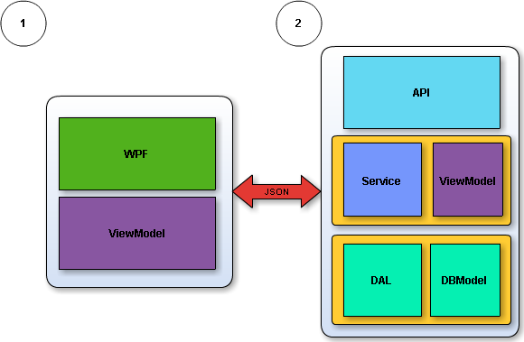

**Northwind Windows Store**
===================

A simple **Windows Store App** project based on the **.Net** platform.  It' s meets the following guidelines:

 - Windows Store App 
 - MVVM pattern 
 - SQLite 
 - SQlite ORM framework 
 - REST, JSON
 

<i class="icon-list"> Goals
------------------------------
**Must have**

 1. Fulfill all guidelines

 2. Average performance

 3. N-tier architecture

**Nice to have**

 1. Intuitive GUI

<i class="icon-book"> Planning
------------------------------
The planning includes several steps of research. the main

 - **Databse** - the *Northwind* database was selected.

 - **ORM** - *Dapper* was selected, because of its high performance and the simplicity it provides. 

 - **Additional GUI components** - the components bundle of choice is *Telerik*.

 - **Object mappers** - For object translation framework the *TinnyMapper* was selected.

<i class="icon-sitemap"> Implementation
------------------------------
The application was divided into several layers, as shown on the following image

 1. **GUI section** 
 
 	**WSA** - part of the application dedicated for user interface utilizing the most of the Telerik components as possible.
 
 	**ViewModel** - the same part (included) as the server part only extended for specialized views.
 2. **Server section**
  
	**API** - api interface using the *ASP.Net WebAPI* framework. The API based on it's simplicity isn't secured. 

	**Service** - decides what to use DB View or DB Table according to the provided model. The service layer provides also the transformation functionality DBModel to ViewModel.

	**ViewModel** - model of data that will be sent and then displayed in the application.

	**DAL** - the layer realises a generic repository pattern for data access.

	**DBModel** - models for *DAL*.
<i class="icon-ok"> End result
------------------------------

